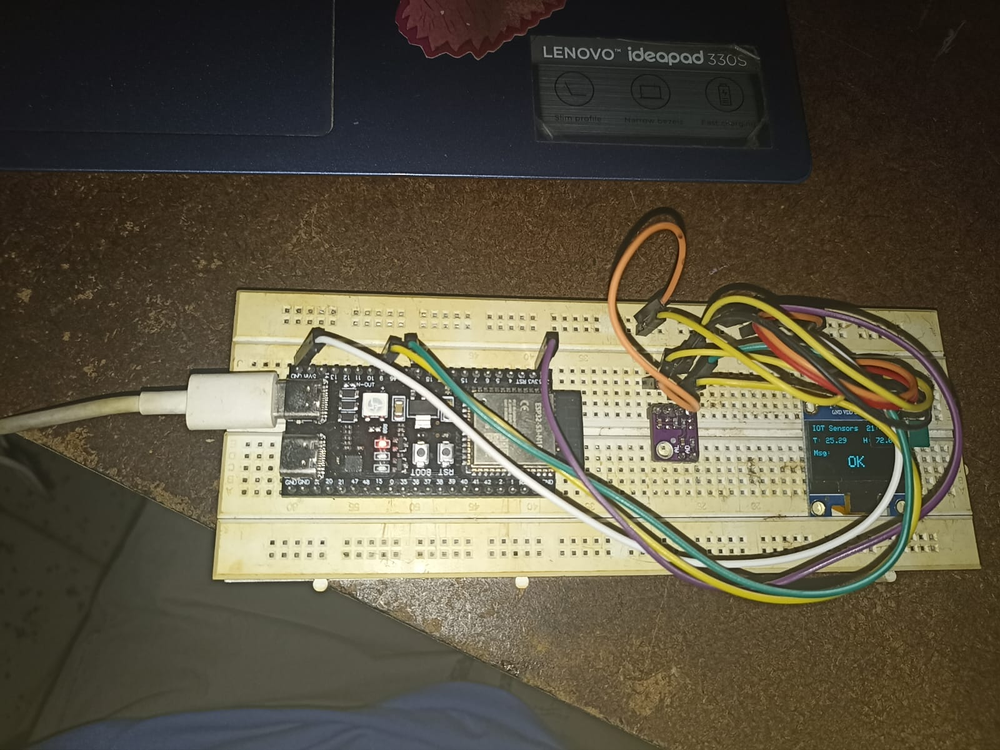
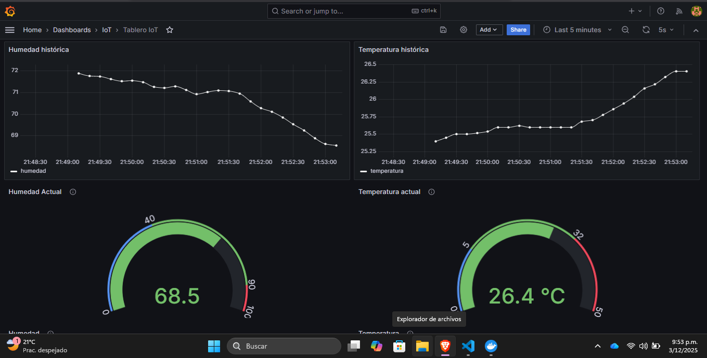
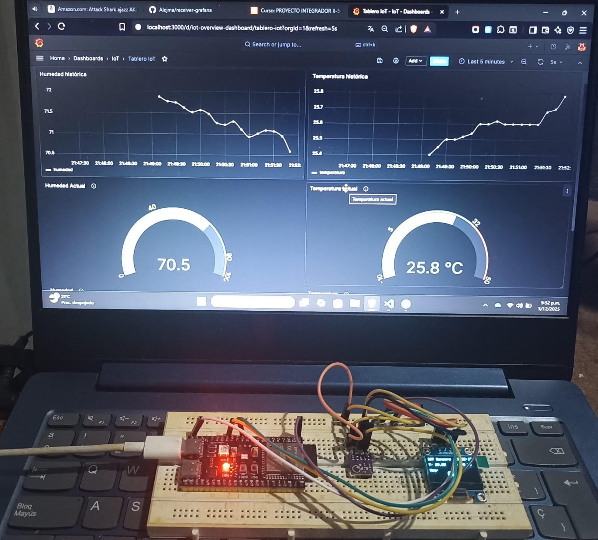

# 📡 Sistema IoT – Captura, Almacenamiento y Visualización de Datos (MQTT + TimescaleDB + Grafana)

Este proyecto implementa un sistema completo para la captura, almacenamiento y visualización de datos IoT usando MQTT, TimescaleDB y Grafana.  
El sistema recibe datos desde un dispositivo ESP32 que mide temperatura y humedad, los almacena en una base de datos temporal y los muestra en tiempo real mediante un dashboard en Grafana.

---

## 📌 Evidencias Fotográficas del Sistema IoT en Funcionamiento

### 🟦 1. Lectura en tiempo real desde la protoboard (ESP32)
En esta imagen se observa el montaje del ESP32 con el sensor midiendo **temperatura y humedad**, mostrando los valores directamente en el display del montaje.

---

### 🟩 2. Dashboard en Grafana recibiendo y graficando los datos
Aquí se muestra Grafana recibiendo en tiempo real los datos enviados por el ESP32 a través del broker MQTT.  
El dashboard muestra las gráficas de **temperatura** y **humedad** provenientes del dispositivo.

---

### 🟧 3. Funcionamiento conjunto: protoboard sensando + Grafana graficando
Esta evidencia muestra simultáneamente el montaje real de la protoboard (ESP32 + sensor) y el dashboard de Grafana, verificando que los datos coinciden en tiempo real.

---

## 🧩 Arquitectura del Sistema

El sistema se compone de tres elementos principales:

1. **ESP32** enviando datos vía MQTT (temperatura y humedad)  
2. **Receiver IoT Service** que escucha, filtra y almacena  
3. **TimescaleDB + Grafana** para guardar y visualizar series temporales  

---

## 🚀 Tecnologías Utilizadas

- **MQTT** – Comunicación ligera entre el ESP32 y el servidor  
- **TimescaleDB** – Base de datos optimizada para series temporales  
- **Docker Compose** – Orquestación de servicios  
- **Grafana** – Visualización de datos en tiempo real  
- **ESP32** – Microcontrolador encargado de sensar el entorno  

---

## 🛠️ Funcionamiento General

1. El **ESP32** mide temperatura y humedad.  
2. Envía los datos mediante un **tópico MQTT**

